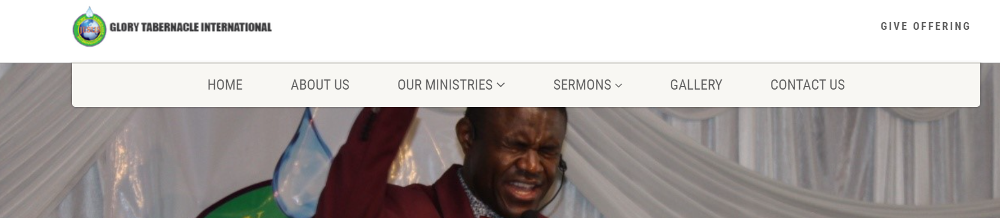
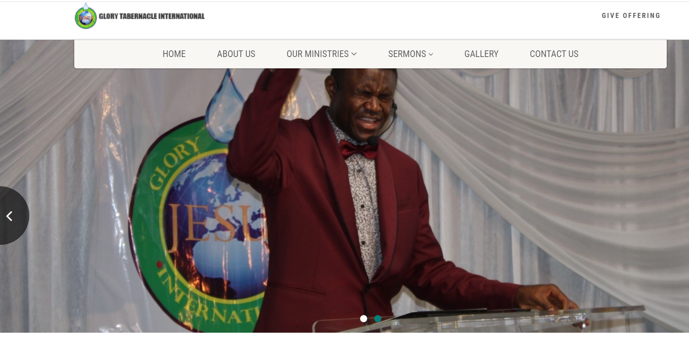
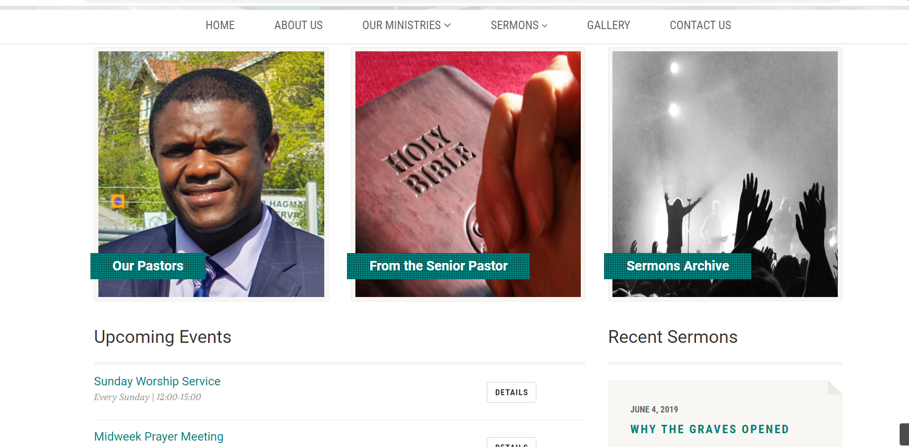
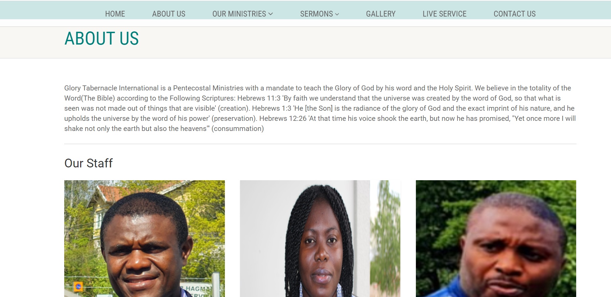
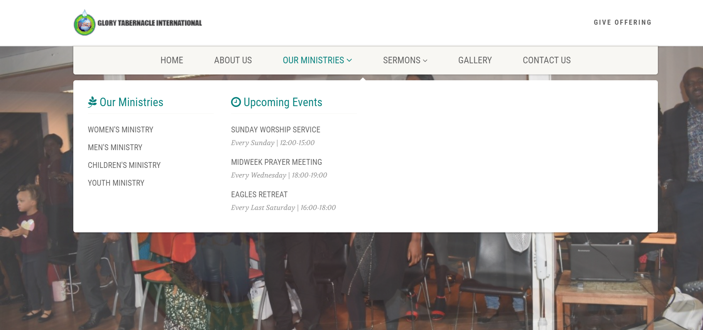
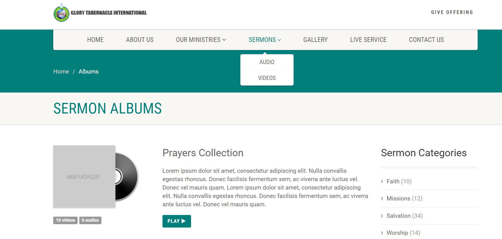
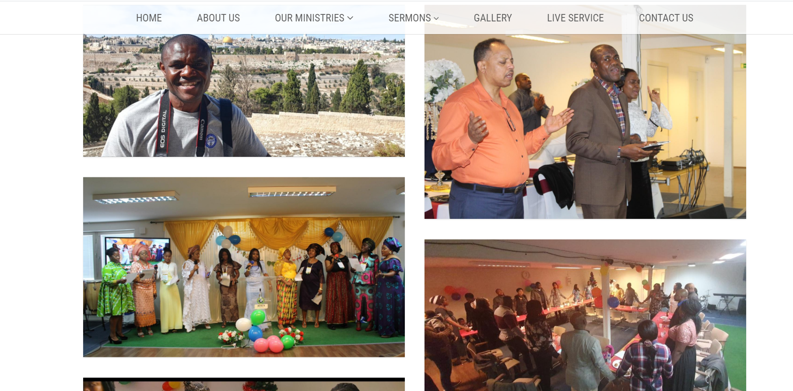
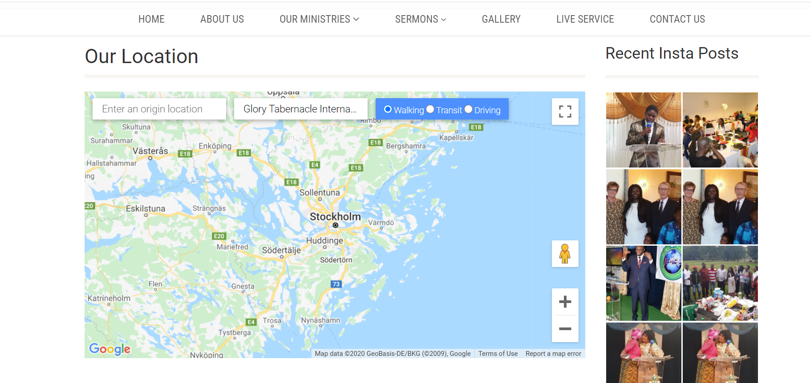
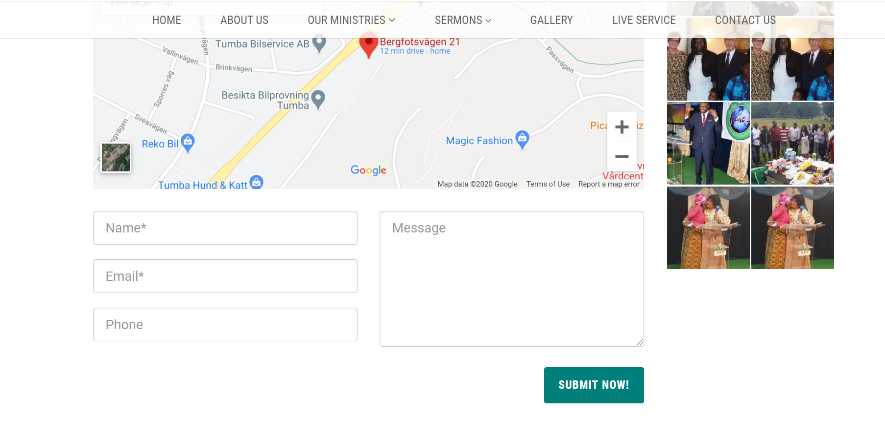
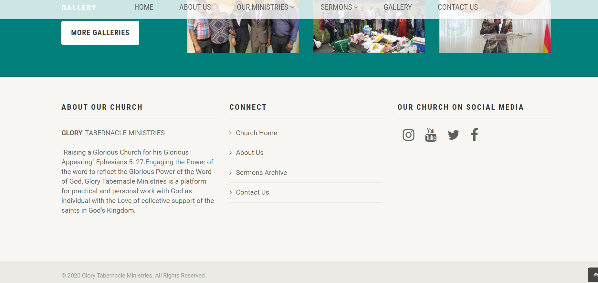

# Second Milestone Glory Tabernacle Ministries

**Project's Name – Glory Tabernacle International**

**Project Title:**

The project is a real life project for my church in Sweden, it is a website project with the aim of giving visitors access to all necessary information about the church, the mission, the leaders, the different department of the church and how interested visitors could Join. Glory Tabernacle is a non-governmental foundation that helps people with focus on Spiritual, social, and economic development of people.

**Brief Project Method:**

The method use in the project are primary acquire from the Code Institute Fullstack Software Development Course modules in HTML, CSS and JavaScript. It is worthy of mention that I have studied other software development free materials, courses on Udemy, snippet codes, templates and Video tutorials on YouTube.

# USER EXPERIENCE PROCESS:

The project is designed for everyone with the smallest basic knowledge of how to browse through a website irrespective of age, the project is aim to be interesting to every visitor right from the home page to every other sections of the website. The following are the User Experience target I have in mind in the process of development:

•	*Simplicity and beauty:* The aim is to make the website easy and direct to navigate while yet being interesting and captivating.

•	*Informative:* to give as much necessary information as possible that visitors need to know about the church.

•	*Interest:* give all information for all age group that are interested in coming to church.

•	*Connectivity:* Different platforms that are available to join the church including even social media.

•	*Contact:* Opportunity to contact the church and request specific or more information.

## Visitor Goals:

As a church, it is important for visitors to be able to have direct contact and the have access to the different programme the church has with specificity to even gender and age group. Hence, I prioritize the following while developing the website:

•	*Contact:* a working contact form where visitors can ask for information and submit requests.

•	*Map Direction:* Visitor would be able to get real time direction from their location to the church facility through google map API.

•	*Applied Content:* visitors have access to audio and video materials as regards the services of the church.

•	*Live Event:* visitors will be able to join live events of the church by providing a navigation link directly to the YouTube channel of the church where live services are streamed.

•	*Social media account:* Links to different social media accounts to provide updates and vital information for visitors. 

•	*Future Meet up:* Sections to provide information about future special programmes and weekly meetings for those interested.

•	*Gallery:* Pictural evidence of what to expect at the church, people of different ethnic and culture with same spiritual fundamental belief.

These points above are the focus of solution the website is expected to provide for every visitor and that have been achieved.

# User Stories:

As a visitor to the website these are my expectation:

1.	Clear and easy navigations.

2.	Easy and understandable information access.

3.	Avoidance of over-crowded information and presentation.

4.	Contents to define what organisation is all about.

5.	Leadership of organisation.

6.	Different section and departments.

7.	How to contact and make inquiries.

8.	Most importantly how to join the church.

# Features:

Navigation bars: Designed for easy and quick access to different sections of information which the visitor intend to know, navbars such as: Home, About us, Our Ministries, sermons, Gallery and Contact will provide these accesses.

**Home page:** 

The home page consist of two slides displaying pictures of service meetings at the church, a link to know the leadership of the church, a welcome note from the senior pastor, a quick access to sermon archive. A short video to tantalize the interest of the visitor, sections for weekly and future meetings, a link to the Gallery down the middle of the home page without going back up and footer with brief description of church and important navigation links.

**About us:**

This section gives all necessary information about the leadership of the church, pictures and a brief biographical description was provided.

**Our Ministries:** 

In this section the website visitor will be able to check out the different department of the church specifically for example: women and men department, with specific information concerning what they do and even the location and time of meeting. Upcoming event information are also available in this section.

**Sermons:** 

By clicking on this navbar the visitor will be presented with the option of choosing between audio or video sermon, with topics and the names of the authors indicated. As a church this is an important section for the visitors to be able to access the kind of messages being propagated in the church and decide for themselves.

**Gallery:** 

Visitors will be able to see the pictures of different events of the church, reassuring them that people of all race, gender and nationalities are welcome in the church.

**Live Service:** 

Visitors will be able to join live real time events of the church by clicking on this navbar. Visitor will be redirected to the church’s youtube channel for live streaming once clicked.

**Contact Us:**

As a church contact is very important and the contact page is designed with this prerogative. A contact form and map has been included for visitors’ use in contacting the church, while updates from the church social media can be see for further information.
More on the Contact Page:

1.	A map referenced to google location API from where visitors’ can find direction with real time different travel options from their location direction to the church.

2.	A contact page that require necessary details like email address, name for the church to be able to respond to the sender.

3.	All sent email are directed to the address of the church once the visitor clicks send.

4.	Live feed pictures from the Instagram handle of the church through Instagram API.

**Give Offering:** 

As an NGO the church all visitors interested in making donations to the church will be able to do that using from this section.

**Footer:**

Visitors’ will be able to go back to any section they want to go back to view through navigation links at the footer, visitors can also check out the different social media account via nav links the footer.

# Future Ideas for the website:

•	Add a live chat session where visitors can ask questions get responses in real time.

•	Enable donation online for the church through the website.

•	Create an ecommerce database for sales activities eg. Sales of books and other literatures.

**CONTENT:**

Then text and images on the website are temporal and I got the permission of the church for the pictures used, other pictures were sourced from the web free of charged and are licensed for public usage.

*Languages:* The project is developed using HTML5,CSS4,JAVASCRIPT AND JQUERY.

**Technologies used:**

•	Git to handle version control.

•	GitHub to store and share all project code remotely.

•	Gitpod to create workspaces.

•	The project uses Boothstrap CDN, Font awesome and Icons links.

•	Bootsstrap  to ensure mobile-first responsiveness.

**Colours:**

Main colours used were whit and green, a representation of Glory also specified by the church.

**Icons:**

Used are mainly for the social media and links where gotten from font awesome icons website.

**Libraries and tools:** Have been used to construct this project includes:

Deployment of newworldsalon website to GitHub:

*How to run this project locally:*

•	To run this project on your own IDE

•	Ensure you have the tool GITPOD ONLINE IDE

•	Ensure to have a registered gitpod account inorderto access all functionalities on the site locally

**Below is the step I followed to deploy my site to GitHub.**

I used the below command to secure my work by pushing them to the repository file that was created for the project on GitHub.

•	git init

•	git status

•	git add .

•	git commit -m "first commit" .

•	git status

•	git push

# Manual Testing
Below is a detailed account of all the manual testing that has been done to confirm all areas of the site work as expected. Testing undertaken on desktop All steps on desktop were repeated in browsers: Firefox, Chrome and Internet Explorer and on two different desktop screen sizes. Elements on every page

**Testing:**

This responsive and adapts to all sizes. The links on the navbar to the the sections have been tested and funtions well. Every link takes you to the right sections. The home page keeps the user on the first section since it is the homepage. Though I am aware the homepage on the navbar could be deleted since it takes the user no where other than the first page that could be seen already. The reason why is there is to let them know that is the Homepage. Every sections have been tested to ensure they all work well as intended.
The pictures displays clearly and fine on the different sections. All links used for icons and buttons are tested to function well for the user experirnce to be achieved. Every details have been provided to give the user a straightforward guidance towards achieving their goals.
These test have been done manually by me checking them out on the external website to ensure results are shown as expected.

•	The Html test code - code was ran on the html testing site through W3C markup validation service website:

 https://validator.w3.org/, Html viewer code beautify - https://codebeautify.org/htmlviewer/

1. **Navbar:**

•	I clicked each link on the navbar to ensure they are directed to the right file and functional. Where dropdown nav menu is expected I check to see they are working.

2. **Footer:**
•	I hover over links in the footer, confirm the color change animation works as expected.

•	I clicked all links in the footer, confirm that they take the user to the relevant pages within the site. Example, Facebook, Instagram and youtube.

•	I clicked the facebook icon, confirm that it opens a new tab and takes the user to the church facebook page.

•	I checked date of copyright information, confirm year displayed is same with the current year.

**Home Page**

1. *Home Slider:*

•	I confirmed slide are functional and the image is cropped in an attractive way.

2. *Call to action buttons links:*

•	Hover over all buttons on the navbar, confirm the color change and shadow on hover appear as expected.

•	I checked that text are bold enough to read clear on the home page.

3. *Information sections:*

•	I ensured all the links to all different information are directed rightly and functional.

•	I ensured right pictures were used, and the text were clear.

•	Information were not overcrowded and presented attractively not to bore users.

4. *Gallery page*

•	I checked that on clicking the show all available images on the gallery section are visible.

•	The pictures were arranged orderly to be interesting to the web visitor.

•	The link to the Gallery on the homepage is also functional.

5. *About Page:*

•	I checked that the image of the leaders and information about the church are cleary summarized any visitor.

7. *Contact Page:*

•	A contact form to be submitted with relevant details of the sender.

•	A functional google map with direction from any location of the visitors.

•	Live feed from the instagram handle

•	Users required to fill in the right details eg names, email address.

**Elements on every page**

1. *Navbar:*

•	When the user opens the website on mobile, confirm that the navbar is collapsed into a burger icon

•	Click the burger icon, confirm that the navbar list appears are expected.

2. *Footer:*

•	Scroll to the bottom of the page, confirm that the footer contents is displayed as expected.

•	No content squashed or squeezed or disproportionate in size.

•	Confirm that all links and buttons in footer are easy to click on the smallest screen sizes.

3. *All sections:*

•	Navigation to all sections on the site, check that the layout is as expected for the screen size.

•	Check that all buttons, menus, forms and other elements are the correct proportions and easily clickable.

# Credits

**Tutorial videos:**

https://www.youtube.com/watch?v=dEDKOcPuXlU
https://www.youtube.com/watch?v=GZvSYJDk-us
https://www.youtube.com/watch?v=ecT42O6I_WI
https://www.youtube.com/watch?v=W6NZfCO5SIk

**Other Materials:**

https://rapidapi.com/blog/how-to-navigate-and-connect-to-instagrams-api/
https://instafeedjs.com/#/
https://developer.mozilla.org/en-US/docs/Learn/JavaScript/Client-side_web_APIs/Introduction

**Code Snippets:**

https://demo1.imithemes.com/
https://www.w3schools.com/js/js_if_else.asp
https://www.w3schools.com/js/js_api_geolocation.asp

**Pictures Used:**

https://www.pexels.com/sv-se/foto/andlig-andlighet-be-bibel-267559/
https://www.pexels.com/sv-se/foto/andlig-andlighet-ara-be-2351722/
Glory Tabernacle church pictures.

Aknowledgement:

I wish to thank my mentor for his support and direction from the beginning of the program and particularly through the project. Thanks for all the materials to help understand JS better.

